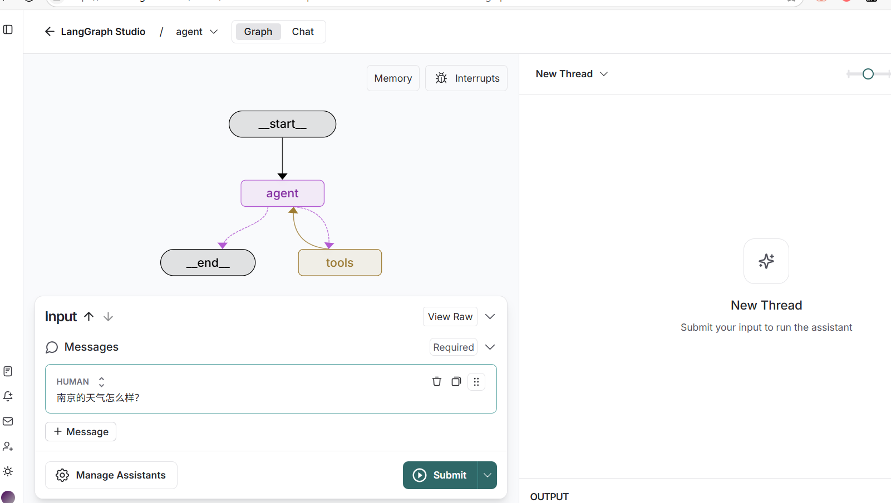
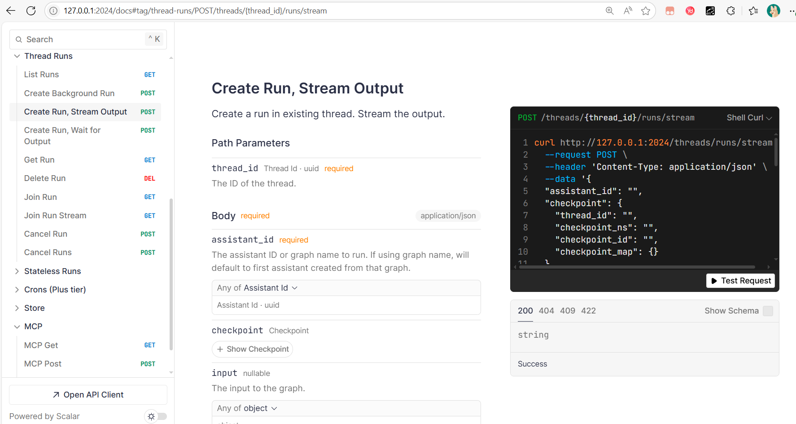

参考文档教程：
https://langchain-ai.github.io/langgraph/tutorials/langgraph-platform/local-server/

LangGraph Platform 快速入门¶
本指南介绍如何在本地运行 LangGraph 应用程序。


# 1. 安装 LangGraph CLI
##  Python >= 3.11 is required.

创建 LangGraph 应用程序¶

pip install -U "langgraph-cli[inmem]"  -i https://pypi.tuna.tsinghua.edu.cn/simple/

或者
uv pip install -U "langgraph-cli[inmem]"  -i https://pypi.tuna.tsinghua.edu.cn/simple/

# 2. 创建一个 LangGraph 应用程序
## 命令示例：

langgraph new path/to/your/app --template new-langgraph-project-python

## 创建一个空的 LangGraph 工程，名字为 project_demo

langgraph new  project_demo  --template new-langgraph-project-python


实际上会下载一个模板项目，并解压到指定目录。，网络不好，容易失败；

📥 Attempting to download repository as a ZIP archive...
URL: https://github.com/langchain-ai/new-langgraph-project/archive/refs/heads/main.zip


这将创建一个空的 LangGraph 工程。您可以通过将 中的代码替换为您的代理代码来修改它。例如：src/agent/graph.py

# 3. 安装项目的依赖包

下载不好可以跳过，直接进入本项目下的 deploy_dir/project_demo 目录
## 进入项目目录
cd  deploy_dir/project_demo


## 安装依赖包

pip install -e .  -i https://pypi.tuna.tsinghua.edu.cn/simple/


# 4. 创建变量文件.env

你会在新的 LangGraph 应用程序的根目录中找到 a。在新 LangGraph 应用程序的根目录中创建一个文件，并将文件内容复制到其中，并填写必要的 API 密钥：.env.example  复制到  .env  文件


cp .env.example .env


# 5.修改 src/agent/graph.py
下面展示完整的graph.py文件内容，您可以根据自己的需求进行修改。


```python
from langgraph.prebuilt import create_react_agent


# 先创建llm
import os
from langchain.chat_models import init_chat_model

API_KEY = "sk-0b4f77927fd7433a971667ed48da63f4"

BASE_URL = "https://api.deepseek.com"

os.environ["OPENAI_API_KEY"] = API_KEY
os.environ["OPENAI_API_BASE"] = BASE_URL


llm = init_chat_model("openai:deepseek-chat")


def get_weather(city: str) -> str:
    """Get weather for a given city."""
    return f"It's always sunny in {city}!"


graph = create_react_agent(
    model=llm,
    tools=[get_weather],
    prompt="You are a helpful assistant"
)
```


# 6 在本地启动 LangGraph 服务器


langgraph dev


# 访问 地址：
- 🚀 API: http://127.0.0.1:2024
- 🎨 Studio UI: https://smith.langchain.com/studio/?baseUrl=http://127.0.0.1:2024
- 📚 API Docs: http://127.0.0.1:2024/docs


# 7 图形化界面调试，访问：
https://smith.langchain.com/studio/?baseUrl=http://127.0.0.1:2024


输入内容：

南京的天气怎么样？




# 视频演示


# 8 接口文档：
http://127.0.0.1:2024/docs




# 9 发送curl的api请求


```python
# 发送curl的api请求

curl --location --request POST 'http://127.0.0.1:2024/runs/stream' \
--header 'Content-Type: application/json' \
--data-raw '{
    "assistant_id": "agent",
    "input": {
        "messages": [
            {
                "role": "human",
                "content": "南京的天气怎么样?"
            }
        ]
    },
    "stream_mode": [
        "values"
    ]
}'
```


```python
# api返回的输出结果

event: metadata
data: {"run_id":"1f03b9e9-0a61-6c1f-8cbf-396ccf9d5d4e","attempt":1}
id: 0

event: values
data: {"messages":[{"content":"南京的天气怎么样?","additional_kwargs":{},"response_metadata":{},"type":"human","name":null,"id":"a2fbfecb-360b-494d-a740-c4adb4ba0b02","example":false}]}
id: 1

: heartbeat

event: values
data: {"messages":[{"content":"南京的天气怎么样?","additional_kwargs":{},"response_metadata":{},"type":"human","name":null,"id":"a2fbfecb-360b-494d-a740-c4adb4ba0b02","example":false},{"content":"","additional_kwargs":{"tool_calls":[{"id":"call_0_42108290-58b1-49b2-84c0-32cf4a68d3d5","function":{"arguments":"{\"city\":\"南京\"}","name":"get_weather"},"type":"function","index":0}],"refusal":null},"response_metadata":{"token_usage":{"completion_tokens":19,"prompt_tokens":107,"total_tokens":126,"completion_tokens_details":null,"prompt_tokens_details":{"audio_tokens":null,"cached_tokens":64},"prompt_cache_hit_tokens":64,"prompt_cache_miss_tokens":43},"model_name":"deepseek-chat","system_fingerprint":"fp_8802369eaa_prod0425fp8","id":"7e0548a8-60b4-46be-aa66-808f6774994a","service_tier":null,"finish_reason":"tool_calls","logprobs":null},"type":"ai","name":null,"id":"run--4abeeefd-8e32-495f-8e00-22622077b575-0","example":false,"tool_calls":[{"name":"get_weather","args":{"city":"南京"},"id":"call_0_42108290-58b1-49b2-84c0-32cf4a68d3d5","type":"tool_call"}],"invalid_tool_calls":[],"usage_metadata":{"input_tokens":107,"output_tokens":19,"total_tokens":126,"input_token_details":{"cache_read":64},"output_token_details":{}}}]}
id: 2

event: values
data: {"messages":[{"content":"南京的天气怎么样?","additional_kwargs":{},"response_metadata":{},"type":"human","name":null,"id":"a2fbfecb-360b-494d-a740-c4adb4ba0b02","example":false},{"content":"","additional_kwargs":{"tool_calls":[{"id":"call_0_42108290-58b1-49b2-84c0-32cf4a68d3d5","function":{"arguments":"{\"city\":\"南京\"}","name":"get_weather"},"type":"function","index":0}],"refusal":null},"response_metadata":{"token_usage":{"completion_tokens":19,"prompt_tokens":107,"total_tokens":126,"completion_tokens_details":null,"prompt_tokens_details":{"audio_tokens":null,"cached_tokens":64},"prompt_cache_hit_tokens":64,"prompt_cache_miss_tokens":43},"model_name":"deepseek-chat","system_fingerprint":"fp_8802369eaa_prod0425fp8","id":"7e0548a8-60b4-46be-aa66-808f6774994a","service_tier":null,"finish_reason":"tool_calls","logprobs":null},"type":"ai","name":null,"id":"run--4abeeefd-8e32-495f-8e00-22622077b575-0","example":false,"tool_calls":[{"name":"get_weather","args":{"city":"南京"},"id":"call_0_42108290-58b1-49b2-84c0-32cf4a68d3d5","type":"tool_call"}],"invalid_tool_calls":[],"usage_metadata":{"input_tokens":107,"output_tokens":19,"total_tokens":126,"input_token_details":{"cache_read":64},"output_token_details":{}}},{"content":"It's always sunny in 南京!","additional_kwargs":{},"response_metadata":{},"type":"tool","name":"get_weather","id":"2d8a9d54-ea9b-47ff-a8cc-6770dc3d5561","tool_call_id":"call_0_42108290-58b1-49b2-84c0-32cf4a68d3d5","artifact":null,"status":"success"}]}
id: 3

: heartbeat

event: values
data: {"messages":[{"content":"南京的天气怎么样?","additional_kwargs":{},"response_metadata":{},"type":"human","name":null,"id":"a2fbfecb-360b-494d-a740-c4adb4ba0b02","example":false},{"content":"","additional_kwargs":{"tool_calls":[{"id":"call_0_42108290-58b1-49b2-84c0-32cf4a68d3d5","function":{"arguments":"{\"city\":\"南京\"}","name":"get_weather"},"type":"function","index":0}],"refusal":null},"response_metadata":{"token_usage":{"completion_tokens":19,"prompt_tokens":107,"total_tokens":126,"completion_tokens_details":null,"prompt_tokens_details":{"audio_tokens":null,"cached_tokens":64},"prompt_cache_hit_tokens":64,"prompt_cache_miss_tokens":43},"model_name":"deepseek-chat","system_fingerprint":"fp_8802369eaa_prod0425fp8","id":"7e0548a8-60b4-46be-aa66-808f6774994a","service_tier":null,"finish_reason":"tool_calls","logprobs":null},"type":"ai","name":null,"id":"run--4abeeefd-8e32-495f-8e00-22622077b575-0","example":false,"tool_calls":[{"name":"get_weather","args":{"city":"南京"},"id":"call_0_42108290-58b1-49b2-84c0-32cf4a68d3d5","type":"tool_call"}],"invalid_tool_calls":[],"usage_metadata":{"input_tokens":107,"output_tokens":19,"total_tokens":126,"input_token_details":{"cache_read":64},"output_token_details":{}}},{"content":"It's always sunny in 南京!","additional_kwargs":{},"response_metadata":{},"type":"tool","name":"get_weather","id":"2d8a9d54-ea9b-47ff-a8cc-6770dc3d5561","tool_call_id":"call_0_42108290-58b1-49b2-84c0-32cf4a68d3d5","artifact":null,"status":"success"},{"content":"南京的天气是晴天！","additional_kwargs":{"refusal":null},"response_metadata":{"token_usage":{"completion_tokens":6,"prompt_tokens":146,"total_tokens":152,"completion_tokens_details":null,"prompt_tokens_details":{"audio_tokens":null,"cached_tokens":128},"prompt_cache_hit_tokens":128,"prompt_cache_miss_tokens":18},"model_name":"deepseek-chat","system_fingerprint":"fp_8802369eaa_prod0425fp8","id":"46b9d414-902a-4813-9c08-beb8f97bd54e","service_tier":null,"finish_reason":"stop","logprobs":null},"type":"ai","name":null,"id":"run--875951ca-7cd5-42c7-8df7-0a53f080513d-0","example":false,"tool_calls":[],"invalid_tool_calls":[],"usage_metadata":{"input_tokens":146,"output_tokens":6,"total_tokens":152,"input_token_details":{"cache_read":128},"output_token_details":{}}}]}
id: 4


```
